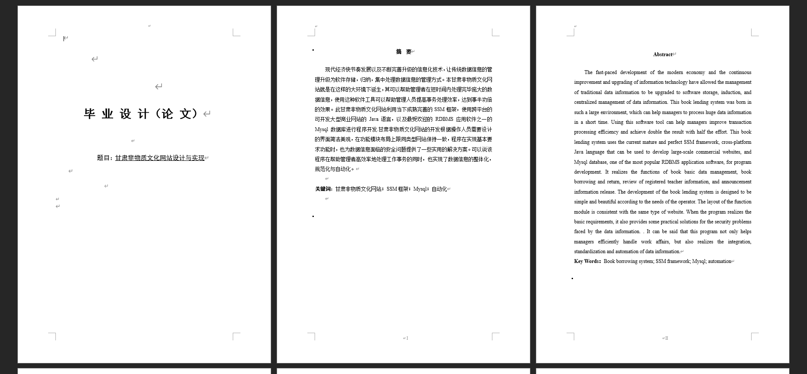
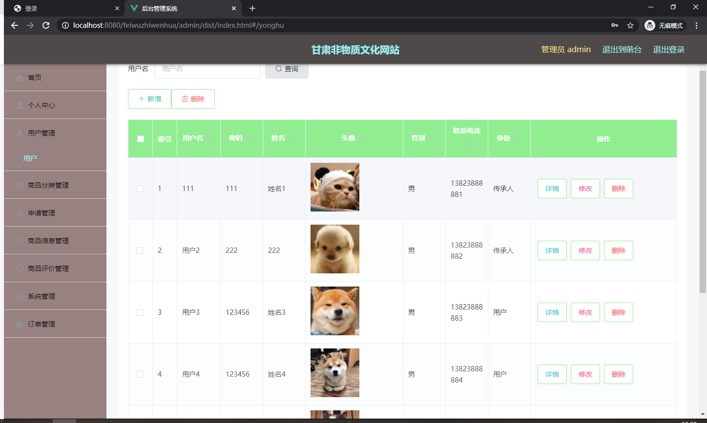
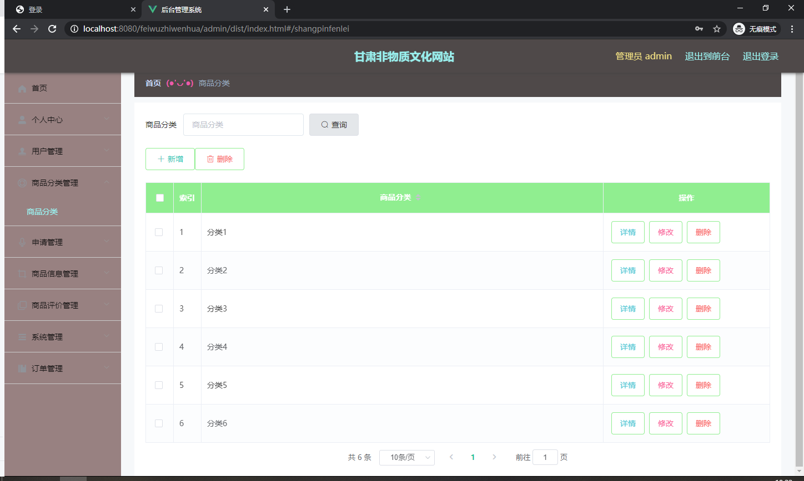
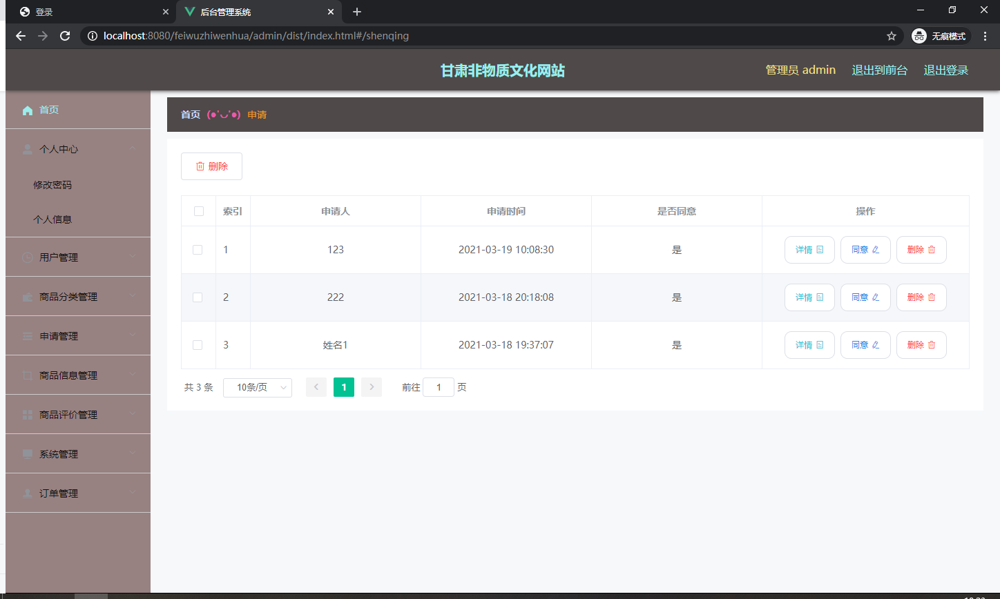
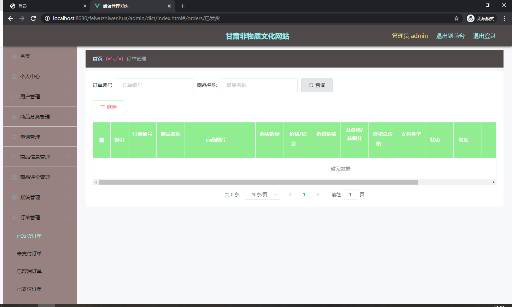

基于Springboot的甘肃非物质文化网站（程序+论文）
=
### 完整代码获取地址：从戎源码网 ([https://armycodes.com/](https://armycodes.com/))
### 作者微信：19941326836  QQ：952045282 
### 承接计算机毕业设计、Java毕业设计、Python毕业设计、深度学习、机器学习
### 选题+开题报告+任务书+程序定制+安装调试+论文+答辩ppt 一条龙服务
### 所有选题地址https://github.com/nature924/allProject

一、项目介绍
---
系统包含两种角色：用户、管理员，系统分为前台和后台两大模块，主要功能如下：
### 用户信息管理

### 用户信息管理页面为管理员提供了以下功能：
- 查询管理用户信息
- 删除用户信息
- 修改用户信息
- 新增用户信息
- 对用户名称进行模糊查询

### 商品分类管理

### 商品分类管理页面为管理员提供了以下功能：
- 查看已发布的商品分类数据
- 修改商品分类
- 作废商品分类（即删除商品分类）

### 申请信息管理

### 申请信息管理页面为管理员提供了以下功能：
- 查看用户的申请信息
- 作废申请信息（即删除申请信息）

### 订单信息管理

### 订单信息管理页面为管理员提供了以下功能：
- 查看用户的订单信息
- 作废订单信息（即删除订单信息）

二、项目技术
---
- 编程语言：Java
- 数据库：MySQL
- 项目管理工具：Maven
- 前端技术：VUE、HTML、Jquery、Bootstrap
- 后端技术：Spring、SpringMVC、MyBatis

三、运行环境
---
- 操作系统：Windows、macOS都可以
- JDK版本：JDK1.8以上都可以
- 开发工具：IDEA、Ecplise、Myecplise都可以
- 数据库: MySQL5.7以上都可以
- Tomcat：任意版本都可以
- Maven：任意版本都可以

四、运行截图
---
### 论文截图：

### 程序截图：

